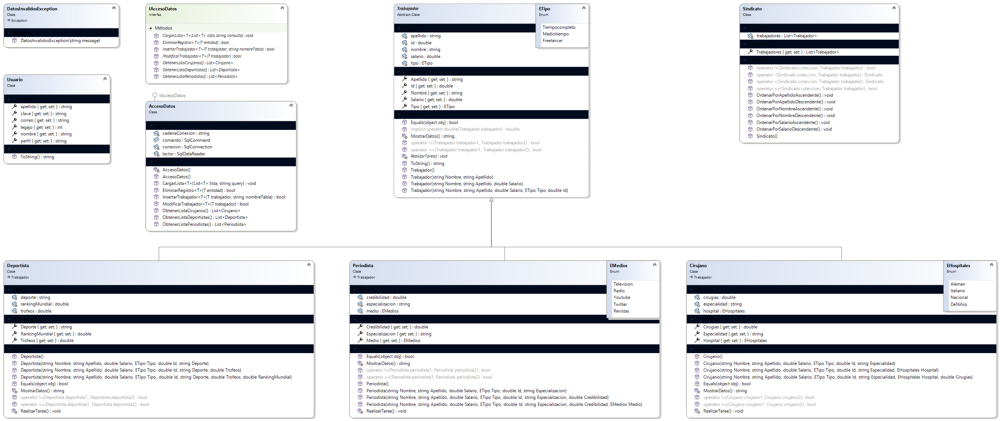

# Sindicato de Trabajadores

## Sobre mí
Soy Theo Torres, estudainte de la UTN de Avellaneda,Buenos Aires. Me egrese de la secundaria el año pasado y ahora estoy buscando insertarme en el mundo laboral de la programacion a la vez que estudio.

## Resumen de la aplicacion
El programa proporciona una plataforma para administrar y organizar a los trabajadores asociados a un sindicato. Permite agregar, modificar y eliminar profesionales de diferentes categorías, como periodistas, cirujanos y deportistas. A su vez ofrece funcionalidades de ordenamiento y visualización de los miembros. Para poder administrar la plataforma es necesario logearse con una cuenta.
Ahora se a agregado una base de datos llamada Trabajadores, en la cual se guardan los datos de cada profesion. Si el usuario logeado es administrador tiene todos los permisos, si es supervisor no puede eliminar trabajadores y si es vendedor solo puede ver la lista.

## Diagrama de Clases

